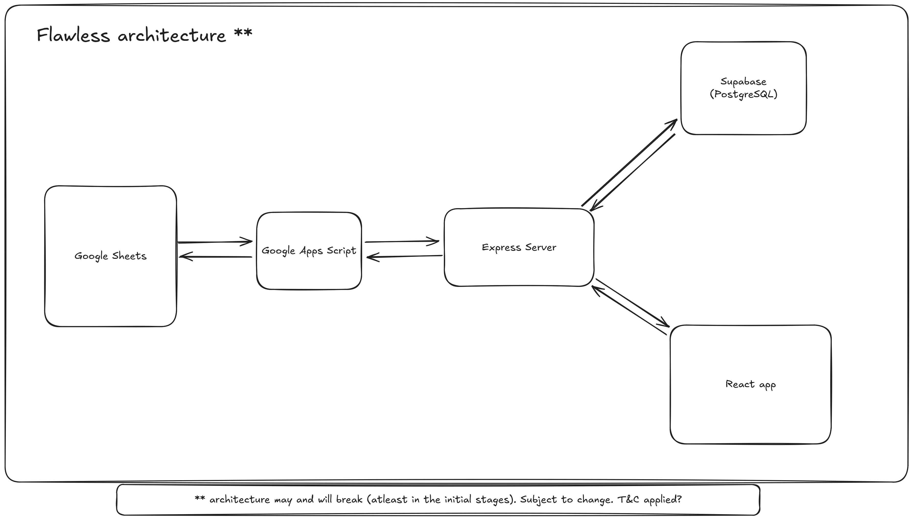
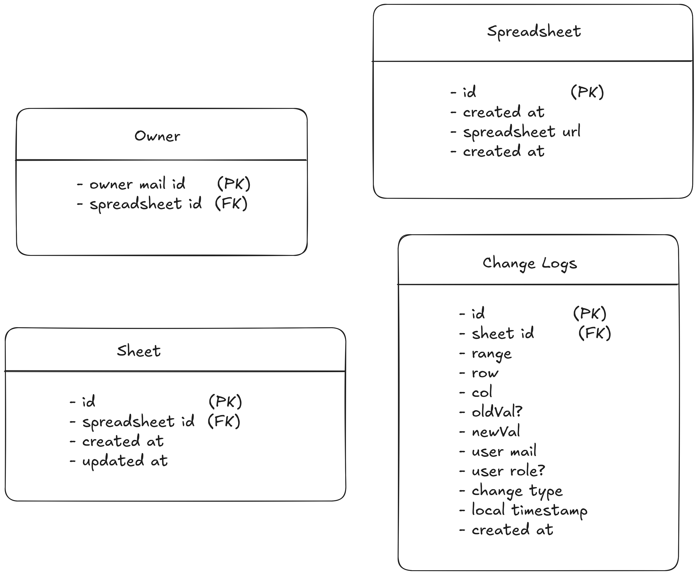

# Thought process, architecture, plan of action 💡

## Architecture in mind

---

- **Google Sheets**
    - Essentially where clients will be doing stuff
    - Need to capture changes made in the sheets and then send out as events to backend
    - Need to look into Google Sheets APIs

- **Google Apps Script**
    - May come in handy for taking care of detecting changes in sheets and then hitting the backend (yet to try)
    - Will also take care of modifying sheets as and when req programatically
    - Need to look into further.

- **Express Server**
    - Where all the magic happens and interface to our DB (Supabase as of now)
    - Gets changes that are made to the sheets, and stores in the DB
    - Also provides data from the DB for the frontend
    - Probably host it on Render

- **Supabase** 
    - Provides hosted PostgreSQL so maybe comes in handy (may change)
    - Will need to take care of schema of data saved
    - Also wil need to make schema to keep note of changes made (something like git logs - may be a far shot)

- **Frontend**
    - Frontend to see all the spreadsheets linked as well as commit history for each sheet
    - basically git logs - so read only 
    - Not essential but good to have?
    - Host it on vercel

---

## Tables Schema

---

This schema should cover majority of the ground required for the entire project

- **Owner table**
    - maps each spreadsheet to the person who created/owns the spreadsheet
    - may be useful for getting more info on spreadsheet

- **Spreadsheet table**
    - holds all the unique spreadsheet that are stored in db
    - quick access to number of spreadsheets available

- **Sheets table**
    - maps each sheet to corresponding table
    - quick access to number of sheets in a given spreadsheet

- **Change logs**
    - keeps track of all the changes done to the various spreadsheets stored in db
    - acts like the git commit history

---

## Plan of action ⚔️
- Right now the basic event based loop for checking updates in the sheet to getting in backend is done
- Need to setup supabase and expose apt endpoints in backend
- Figure out strategy for the updates other way around (webhooks maybe?)
- Get frontend ready to show change logs - might need auth (not a prio)
- Then the hard part - race conditions🏃‍♂️ and conflicts🤺

---