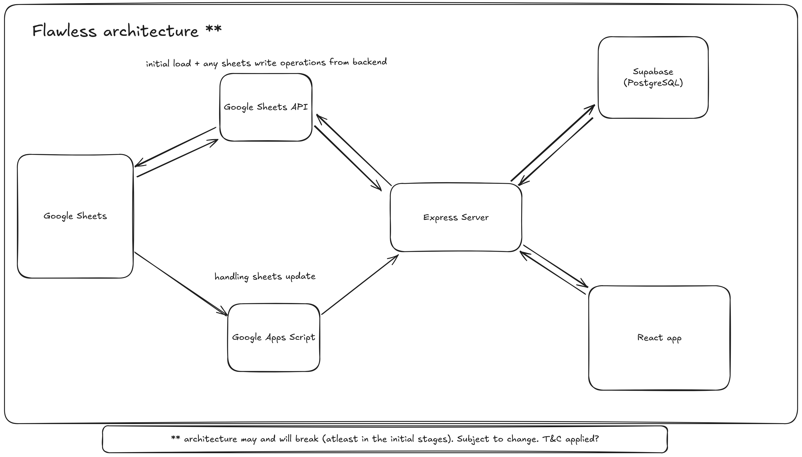
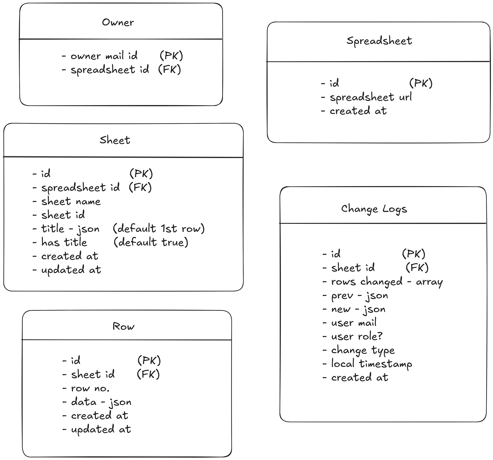
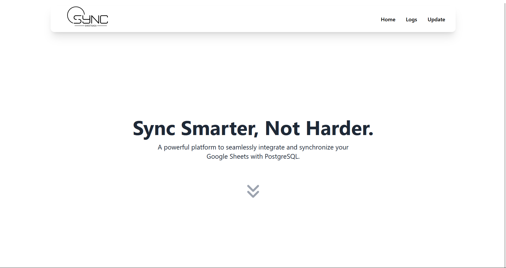

# Thought process, architecture, plan of action 💡

## Architecture in mind

*HLD modified* 

- things got a quite complicated with managing everything with only apps script 
- so will be using google sheets api to take off the load

---

- **Google Sheets**
    - Essentially where clients will be doing stuff
    - Need to capture changes made in the sheets and then send out as events to backend
    - Need to look into Google Sheets APIs

- **Google Apps Script**
    - May come in handy for taking care of detecting changes in sheets and then hitting the backend (yet to try)
    - Will also take care of modifying sheets as and when req programatically
    - Need to look into further.

- **Express Server**
    - Where all the magic happens and interface to our DB (Supabase as of now)
    - Gets changes that are made to the sheets, and stores in the DB
    - Also provides data from the DB for the frontend
    - Probably host it on Render

- **Supabase** 
    - Provides hosted PostgreSQL so maybe comes in handy (may change)
    - Will need to take care of schema of data saved
    - Also wil need to make schema to keep note of changes made (something like git logs - may be a far shot)

- **Frontend**
    - Frontend to see all the spreadsheets linked as well as commit history for each sheet
    - basically git logs - so read only 
    - Not essential but good to have?
    - Host it on vercel

---

## Tables Schema

---

*(Schema updated)*

This schema should cover majority of the ground required for the entire project

- **Owner table**
    - maps each spreadsheet to the person who created/owns the spreadsheet
    - may be useful for getting more info on spreadsheet

- **Spreadsheet table**
    - holds all the unique spreadsheet that are stored in db
    - quick access to number of spreadsheets available

- **Sheets table**
    - maps each sheet to corresponding table
    - quick access to number of sheets in a given spreadsheet
    - has the title for each sheet (1st row)

- **Row table**
    - keeps track of all rows of all sheets
    - stores json object for each row

- **Change logs**
    - keeps track of all the changes done to the various spreadsheets stored in db
    - acts like the git commit history
    - stored the rows changed, prev state & new state

---

## Plan of action ⚔️
- Right now the basic event based loop for checking updates in the sheet to getting in backend is done
- Need to setup supabase and expose apt endpoints in backend
- Figure out strategy for the updates other way around (webhooks maybe?)
- Get frontend ready to show change logs - might need auth (not a prio)
- Then the hard part - race conditions🏃‍♂️ and conflicts🤺

---

## Step to make it work on any Sheets
- Need to share sheet with `shreadsheet-writer@superjoin-assignment-435615.iam.gserviceaccount.com` as editor for it to work
- The essential .gs files are [here](./google-apps-script/)
- Create triggers in the apps script for your excel
- onOpen -> call function onOpen
- onEdit -> call function onEdit

---

## Finale 🥂

- Everything is setup hosted and ready to use
- Website can be found [here](https://sheet-saga.vercel.app/) and the repo which its hosted on is [this](https://github.com/Larry8668/sheet-saga)

- The backend of the hosted website can be found [here](https://github.com/Larry8668/sheet-saga-backend)

- I ve parallely made changes to this repo as well as both the hosted one. So this repo will have the latest code. (Hosted on separate repo as was unsure if i was allowed to host this repo)

- You can find the video explaination [here](https://www.loom.com/share/681424d03732430c95d9d0e752817967?sid=9421c72a-0b16-485b-bc25-ea661a91f53f)
- P.S. if the link doesnt work it will be uploaded in the video folder [here](./video)  
- P.P.S (sorry for the long vid - had a bunch of features to cover 🥲)

### Tackling conflicts
- I plan to tackle conflicts in read write by maintaining a simple lock (sort of a mutex lock)
- So any changes to db will be made only if lock is available
- This will ensure and help prevent locking
- As of now plan to use a queue in case of req that come in when lock is unavailable and then evaluate them based on first-come-first-serve
- So this will behave sort of like the last-write wins